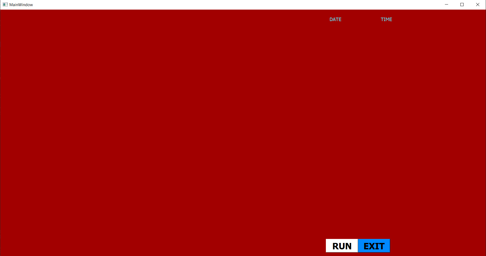

  _______ _    _ ______  _____ _____      __     __  _____  ________      ________ _      ____  _____  ______ _____   _____ 
 |__   __| |  | |  ____|/ ____|  __ \   /\\ \   / / |  __ \|  ____\ \    / /  ____| |    / __ \|  __ \|  ____|  __ \ / ____|
    | |  | |  | | |__  | (___ | |  | | /  \\ \_/ /  | |  | | |__   \ \  / /| |__  | |   | |  | | |__) | |__  | |__) | (___  
    | |  | |  | |  __|  \___ \| |  | |/ /\ \\   /   | |  | |  __|   \ \/ / |  __| | |   | |  | |  ___/|  __| |  _  / \___ \ 
    | |  | |__| | |____ ____) | |__| / ____ \| |    | |__| | |____   \  /  | |____| |___| |__| | |    | |____| | \ \ ____) |
    |_|   \____/|______|_____/|_____/_/    \_\_|    |_____/|______|   \/   |______|______\____/|_|    |______|_|  \_\_____/ 
                                                                                                                            
                                                                                                                            @copyrights 2022


## follow us on instagram  https://www.instagram.com/tuesdaydevelopers/
## github https://github.com/tuesdaydev


# **Possible Errors while installing modules**

## PyAudio errors
- For PyAudio errors in **windows**, please refere stackoverflow solution [here](https://stackoverflow.com/questions/52283840/i-cant-install-pyaudio-on-windows-how-to-solve-error-microsoft-visual-c-14)
- For PyAudio installation errors in **linux**. You need to follow the below instructions:

```sudo apt-get install portaudio19-dev python-pyaudio```

```pip install PyAudio```

Most probably the errors will be resolved
- That's it run the program in the ***cmd*** the screen rocording will be started.
- To stop the recording *press the '**q**' key to stop the recording*

## ffmpeg errors
If you get any errors😞 regarding **ffmpeg** follow the instructions :

- From [here](https://www.videohelp.com/software/ffmpeg) Download the **ffmpeg** save it in any folder you want.
-  Press ```windows+R``` to open ```RUN``` enter ```SystemPropertiesAdvanced.exe``` and press enter.
- Click on the ```EnvironmentVariables``` it will open a window
- In the window under ```user variable``` click on the ```Path``` and click the ```Edit``` button, a window called Edit environment variable will be displayed.
- Click the new button and enter the ```bin``` directory path in downloaded  ```ffmpeg``` directory
    
    Eg: ```C:\Users\white devil\Downloads\ffmpeg\bin``` => ```DOWNLOADED-PATH-TO-ffmpeg-DIR\ffmpeg\bin```

- That's it again verify whether it by clicking ```ffmpeg``` in your ```cmd```
### Output for successful working of ffmpeg

[](FinalOutput.png)

## RED SCREEN

[](RED_SCREEN.png)

If you got the above type of similar screen, it is because the path's for the background or the elements are not declared properly, so for this you can declare the name of the files from the home directory in ```JarvisUi.py``` file in case if u got RED SCREEN or any elements are missing.

Eg : I gave the path for the background image from the home directory, the path can be like this.
> ```D:/white devil/JARVIS/JarvisUI/bg2.jpg``` or ```D://white devil//JARVIS//JarvisUI//bg2.jpg``` 
